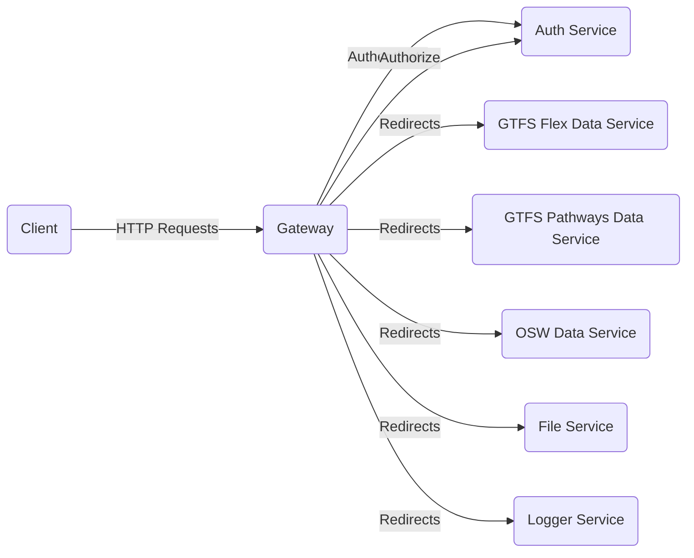

# Introduction

An API gateway is a service which is the entry point into the TDEI application from the outside world.
It's responsible for request routing, API composition, and other functions, such as authentication, authorization of the
requests.

## System flow

Diagram describes Gateway functionality at high level.



## System requirements

| Software | Version |
|----------|---------|
| Java     | 17      |
| Maven    | > 3     |
| Spring   | 2.7.4   |

## Development IDE tool preference

Eclipse (https://www.eclipse.org/downloads/)

Intellij (https://www.jetbrains.com/idea/download)

## Dependencies

Other third-party dependencies used in the project please browse the Maven pom.xml file for details of libraries and
versions used.

## Cloning the project

Clone the project from source controller

```aidl
$ git clone https://TDEI-UW@dev.azure.com/TDEI-UW/TDEI/_git/gateway
```

## Building the project

### IDE

Import the project in your preferred IDE by selecting POM.xml.

### Cli

*Note: Navigate to the cloned repository directory before proceeding for below steps

### 1. Building the server

Use Maven command to build the server. Below mvn command will

1. Cleans the project and removes all files generated by the previous build
2. Builds the maven project and generates the jar package to target directory

```
$ mvn clean install
```

### 2. Running the server

```
$ cd target
$ java -jar -Dspring.profiles.active=dev gateway-0.0.1.jar
```

### 3. Browse API documentation

Navigate to the below link for API documentation and API playground

http://localhost:8080/swagger-ui/index.html

## Running the test

- Uncomment the below line of code from Pom.xml.

  ```<maven.test.skip>true</maven.test.skip>```

- Run mvn command

```
$ mvn test
```

### Development API documentation link

https://tdei-gateway.azurewebsites.net/swagger-ui/index.html
