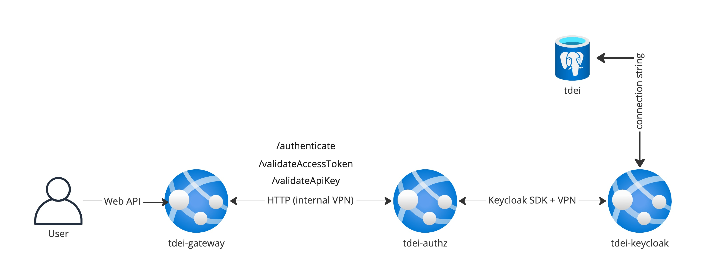

# Current Cloud Infrastructure

This document covers the existing cloud infrastructure available in the TDEI system. This will be a subset of the overall architecture but hosted and is in working condition.

## Components 

### Client system 
- The client system is reference to all the downstream applications and web-apps that make use of the TDEI system. These are connected to TDEI system via REST APIs exposed.
- The REST APIs are documented via Swagger for publicly available APIs and also internal Swaggers for any internal APIs
- The REST APIs are access-controlled based on the PATH and the METHOD.
- There are two ways of access control : API Key based and Access Token based.

### Gateway
- Gateway acts as the primary interface for all the REST APIs
- Gateway connects to Auth-service via VPN + HTTP connection.
- Gateway performs a minimal check of valid AccessToken or API Key via Auth-service for the API calls.
- Gateway processes all the Authentication requests + User Generation (token generation, role change, adding new user) via Auth-service.
- Gateway code  is currently hosted as Azure DevOps repository with a pipeline to generate container and deploy as App Service.(refer to README.md of gateway repo for this)
- All the upload requests are pre-validated and sent to `File-Service` for processing and response is relayed back to the client.
- All the GET requests are sent to `Data service` for processing and response is relayed back to the client.
- All the requests for getting the status of a request/upload or a job are sent to `Logger service`
- The gateway also hosts the Swagger documentation that is exposed to the public.

### Auth service 
- Responsible for authentication of users, user management
- Exposes internal HTTP APIs for authenticating a user and also validating a particular user against a permission. (eg. whether a specific userId is permitted to upload gtfs-flex)
- For all the internal purposes, it connects to Keycloak server via Keycloak SDK + VPN.
- Though there is swagger documentation of the APIs for this, these are not exposed to the public and are for internal use only
- The micro service code is currently hosted in Azure DevOps repository with a pipeline to generate container and deploy as App Service. Refer to README.md of auth-n-z repo 
- The internal HTTP APIs are accessible for all the micro-services within the system but not publicly available.

### Keycloak
- Responsible for user management of the system
- An Opensource implementation of Keycloak along with certain customization is hosted as App Service in Azure cloud. 
- Keycloak version picked is 19.0.2
- It does not expose API to any other system other than Auth-service 
- It connects to TDEI Users Database for all the persistence.
- Currently the code for this is hosted offline and is deployed manually.

### TDEI Users Database
- Responsible for hosting the user information
- Hosted as Postgresql instance in Azure cloud
- Data encryption for password is done at column level
- Data encryption at rest is done volume level by Azure 
- Has open connection only with the Keycloak hosted in the system.

## Component Listing 
The following components are additional azure resources currently in system and used for various purposes.

| Service | Name |  Sub-service | Name | Used for | Is Active |
|-|-|-|-|-|-|
| Container registry | tdei-docker| Container repository | gateway | Hosting the gateway docker image | &check; |
| Container registry | tdei-docker| Container repository | authz | Hosting the Auth service docker image | &check; |
| Container registry | tdei-docker| Container repository | keycloak | Hosting the Keycloak docker image | &check;|
| App service | tdei-spec | | | Hosting the Swagger API definition declared in TDEI-ExternalAPIs repository| &check;|
| App service | tdei-gateway | | | Hosting the gateway for the system |&check;|
| App service | tdei-authz | ||Hosts the authentication service |&check;|
| App service | tdei-keycloak | ||Hosts the Keycloak instance |&check;|
| Service Bus Name space | tdei-sample | Azure Queue | tdei-ev-logger | Used for logging the events and audit logs | _ |
| Service Bus Name space | tdei-sample | Azure Queue | tdei-poc-queue | Used for testing Core functionality with queues |&cross;|
| Storage account | tdeisamplestorage | Storage Table | samplemetrics | Used for capturing sample metrics | &cross;|
| Storage account | tdeisamplestorage | Storage Table | outTable | Used for capturing sample logs for POC via core | &cross;|
| Storage account | tdeisamplestorage | Storage Container | tdei-storage-test | Used to test the storage functionality of Core | &check;|
| Storage account | tdeilogz | Storage Container | app-insights-metrics | Used for auto capturing appInsights (POC)| &cross; |
| Storage account | tdeilogz | Storage Container | app-insights-logs | Used for auto capturing appInsights (POC)| &cross;|
| PostgreSQL instance | tdei | Postgres database | tdei | Storing all the authentication information for keycloak and authentication service | &check;|
| Analytics Workspace | tdeiLogAnalyticsWorkspace | App Insights | tdeiAppInsights | For capturing the app Insights of the system | &check; |