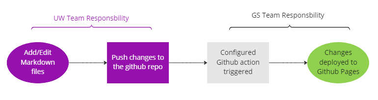

[[_TOC_]]

## Personas
There are three personas that need documentation in TDEI system:
- TDEI System developers: folks that are responsible for writing, building and deploying code that makes TDEI system.
 - TDEI users: folks who would interact with TDEI system to contribute or to consume data.
 - DoT and/or such entities: that need documentation to prove the system is progressing as expected, and is architected well

Each of the personas have a different set of expectations and level of details they need. 

## TDEI System Developers
These folks are responsible for building, deploying and maintaining the TDEI system. They have access to the repositories, cloud infrastructure, build environments etc. Almost every detail of the system is important to them. The solution for TDEI system developers is:
 - **markdown files in code repos**: give information pertaining to that particular repo, what the repos functionality in the overall system is, how to build the repo (whether it is a service, or gateway or whatever), dependencies, design considerations etc.
 - **GitHub pages** explaining: 
    - the architectural decisions made to build the system, with reasoning and/or comparison to alternatives. 
   - the relationship between the code repos, and usage notes, especially core packages, testing tools, etc
   - development strategy /procedures developers are expected to follow
   - CI/CD pipeline details, how they are built, and how the code gets build, tested, and deployed
### Responsible parties:
 - Gaussian Team: Primary point for this type of information especially how the system is built.
 - Individual repo owner: for details on how to use that particular repo (could be GS or UW)

## TDEI Users
Users are people, entities and/or app developers that may interact with the TDEI system. The information most applicable to such cohort is on how to interact with the system including but not limited to: how to register with the system, how to make API calls, and what the responses from those APIs will be. They need a procedure to accomplish a certain task, like a how-to manual. Solution for them is:
 - **Swagger documentation** for API usage. This provides the endpoints defined, the require authentication, what input parameters, and a sample response
 - **GitHub Pages** that get built into a documentation site for how-to interact with the system info. GitHub pages was chosen since it requires the content writer to be familiar with just writing _markdown_ pages. In the background, documentation solution uses [Hugo](https://gohugo.io/documentation/) to build the ['bootstrap'](https://getbootstrap.com/docs/5.2/getting-started/introduction/) kind of website where users can find out details about how to interact with the system.

Both will be deployed as subdomains of TDEI system.
### Responsible parties:
 - Swagger documentation deployment is GS teams responsibility.
  - Primary responsibility for writing the content for GitHub pages lies with UW team. They can leverage info from GS team. GS team will set up the documentation build/deployment solution.

### Github pages workflow:
GS team will setup the initial Github repo and share the repo with UW team, with instructions on how to use the repo to host the documentation. This is a one time step. The following takes place after the initial step is done:

UW team edits / adds content to the Github repo. UW team commits the changes done and pushes them to the repository 

Github Action configured by GS team on the repo is triggered 

Changes are deployed and can be viewed live on Github Pages

GS team has setup the initial repository at https://github.com/TaskarCenterAtUW/TDEI-docs The repository also contains instructions to the "users of the repo for documentation purpose" on how to add/edit a page or section.

The deployed Github pages documentation is available at https://taskarcenteratuw.github.io/TDEI-docs/ 
## DoT
DoT has a bunch of requirements on the kind of documentation we need to provide for the project. These are specific to DoT. Parts of the documentation may come from info aimed for TDEI system developers, and parts of it could be from TDEI user documentation. Ultimately the documents produced for DoT leverage information mentioned elsewhere, where possible. These documents need to be collaborated with CS folks. Microsoft Teams is chosen to be tool of choice, as it supports word documents
### Responsible parties:
 - Primary responsibility lies with UW team. They can leverage info from GS team
## TODO
- [x] Update the links to the user documentation once the deployment happens
- [x] Update the TDEI Users section with how the 'bootstrap' kinda website gets built and deployed pictorial diagram