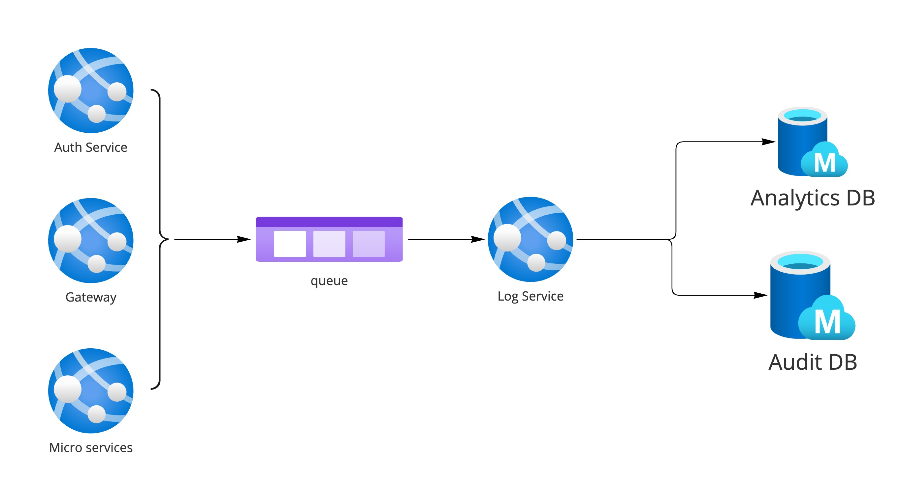

# Audit and Analytics logs flow of data

With the current setup of multiple microservices dealing with multiple reports of data, there is a need to confirm and conclude on the methodology used to collect this data as well.

## Flow of information
The data that is to be captured is sent to a queue and then to the appropriate databases by a separate service all together. This will ensure data to be sent to both event and the analytics database.

All the information will be sent to a queue which will be named `<env>-logger` where <env> represents the environment it is hosted. The input will be from one or any of the following:

- Authorization service 
- Gateway (API)
- Each of the microservices in the system

## Queries and decisions

1. Can we keep both the storages as tables at a single Azure Storage account ?
2. Do we need to be specific on the azure app service for logging service or can we go with azure functions (since it is a simple job) ?
3. Does the above mean that we will have to refactor the core to enhance the logger methods?

## Databases to be used 

Based on the comparison done in the research, it would be better to have both Analytics and Audit information stored under Azure Storage Tables. 

