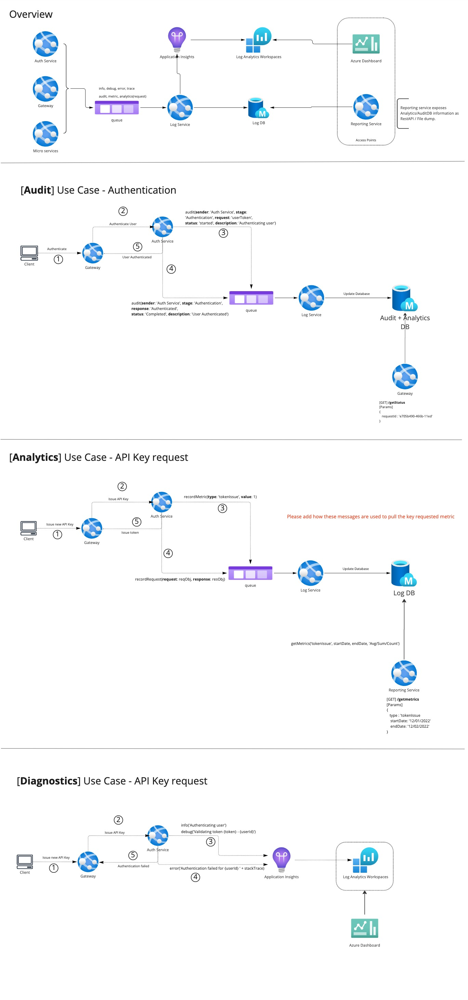

# Audit and Analytics logs flow of data

With the current setup of multiple microservices dealing with multiple reports of data, there is a need to confirm and conclude on the methodology used to collect this data as well.

## Flow of information
The data that is to be captured is sent to a queue and then to the appropriate databases by a separate service all together. This will ensure data to be sent to both event and the analytics database.

All the information will be sent to a queue which will be named `<env>-logger` where <env> represents the environment it is hosted. The input will be from one or any of the following:

- Authorization service 
- Gateway (API)
- Each of the microservices in the system

## Queries and decisions

1. Can we keep both the storages as tables at a single Azure Storage account ?
- Yes. The audit and analytics data will be stored in separate tables of the same storage account.
2. Do we need to be specific on the azure app service for logging service or can we go with azure functions (since it is a simple job) ?
- Since logging may also updates and pushes, it is needed to have app service instead of function. A function can be used if there is only data adding.
3. Does the above mean that we will have to refactor the core to enhance the logger methods?
- Yes the logger logic will have to accomodate the changes appropriately. This means adding new methodology as well.
 - Audit will be different object but available within Logger object.
 - Analytics will be another method to add any kind of data into the database.
 - Current methods will remain the same.
 - recordMessage (method missing currently) will be added.

## Databases to be used 

Based on the comparison done in the research, it would be better to have both Analytics and Audit information stored under Azure Storage Tables. 

## Logger API targets information 

| API Method | Current Target location | Proposed Target Location |
|-|-|-|
| log() | AppInsights | AppInsights |
| debug() | AppInsights | AppInsights|
| info() | AppInsights | AppInsights |
| trace() | AppInsights | AppInsights |
| recordRequest() | AppInsights | Log DB (API) |
| recordMetric() | AppInsights | Log DB (Metric) |
| analytics.record() | NA | Log DB (Analytics) |
| recordMessage() | NA | Log DB (Queue) |
| audit.* | NA | Log DB (Request + Event) |
| sendAll() | AppInsights | NA |

# Decisions made 

- Logging will have single separate queue with multiple topics for `audit` `metric` `analytic` `info` `debug` `error` `trace`
- Logs (audit, metric and analytic) will be stored in a single separate storage account with tables for each.
- Logger in the core package will be enhanced to support for the changes