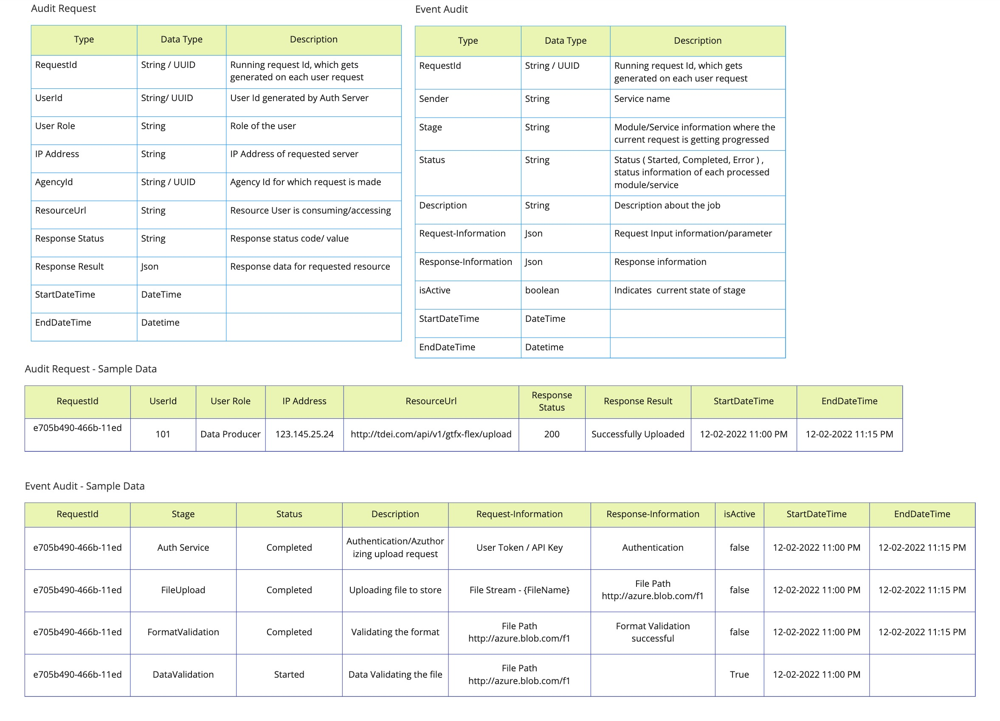
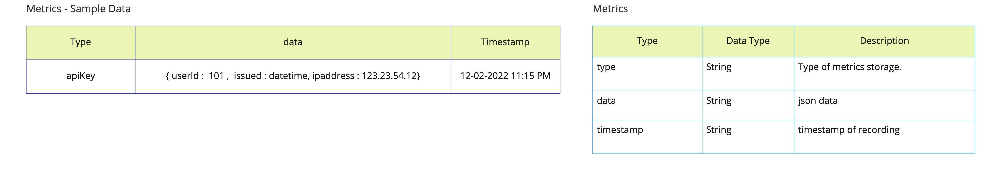

# Monitoring and auditing strategy
This document references the proposed strategy to accomodate the performance, audit and monitoring requirements of the system. The base requirements for this are captured under 
#50 
All the monitoring and auditing needs are handled by composing them into logs and storing/retreiving them appropriately. Once the logs are persisted, another micro-service exposes the information 
required as APIs.

The overall architecture for capturing the logs is as follows:

NOTE: Diagram to change the queue
## Architecture
- All the microservices send the audit/log/monitoring information as messages to `ms-logger-queue` via the methods exposed in `Core` library.
- The `Log service` is a microservice that listens to events/messages on `ms-logger-queue` and logs into appropriate location.
- The records are either stored in AppInsights or into Log DB based on their differentiation. 
- Log DB is hosted as Azure Storage tables with different tables handling different types of logs. However, it is under a single Storage account. Thus, its considered single entity on cloud.
- App Insights is configured within Log service
- All the API requirements for monitoring or notifications are exposed via `Reporting service`
- The differentiation of logs along with their details is explained in the next section.

### Components
The following table describes breifly about the components of the system

| Component Name | Composition | Azure service used | Ownership |
|-|-|-|-| 
| Auth Service | Springboot based Java application deployed on App Service via Container registry | App Service + Azure Container Registry | GS |
| Gateway | Gateway service deployed on App Service via Container registry | App Service + Azure Container Registry | GS |
| Micro services | Multiple micro-services written in either Node or Python with Core package from GS. Hosted either directly on App Service or via Container registry | App Service | GS + UW |
| ms-logger-queue | Logging queue exposed to micro-services via cloud configuration with Core. | Azure Service bus + queue | GS |
| Log service | Micro-service hosted in App service | App service | GS |
| Log DB | Azure Storage tables under single Azure Storage account with multiple tables | Azure storage account + Azure Storage tables | GS |
| Application Insights | Common App Insights configured for the complete system | AppInsights | GS |
| Reporting Service | API based reporting service for all the monitoring needs hosted via App Service | App service | GS |
| Azure Dashboard | App Analytics workspace on top of common AppInsights | Log Analytics Workspace | GS | 

## Logs differentiation
Based on the kind of information logged and their relevance, the logs are divided as follows:

### Diagnostic logs 
These are logs used by the developers of the micro-services to figure out any issues related to the development and also any additional information that needs to be logged 
for development and debugging usage.

There are two ways in which the logs can be captured.
1. Using the Core() methods . (eg. `Core.getLogger().info("xxxx")`)
2. Using the regular `console.x` methods. (eg. `console.log("xxx")`)

- The logs captured with `Core` methods are available under a centralized AppInsights which is common for all micro-services.
- The logs captured with regular `console.x` may not be available in the centralized AppInsights. However, if the azure resource is configured in cloud with AppInsights, the logs
 may be available in that particular AppInsights.
 - The diagnostic logs captured either way in AppInsights are **retained for 90 days**.

 ### Audit Logs
 These are the logs used for tracing the system. Typical usage includes the number of API keys generated for an agency, users created, files ingested and the amount of time it took.
 These are exposed to the developer via `Core.getLogger().getAuditor()` object. 
 - For any audit that requires a trail of events, an audit request is created and is updated appropriately.
 - An audit request may have different stages based on the work flow. (eg. gtfs-flex ingestion or user api key generation)
 - An audit request gets updated in different stages and the log of each stage is captured as an audit event (linked to audit request)
 - An audit request may or may not have events associated with it based on the stage and the work flow.
 - Analytics logs are persisted in Azure Storage tables with **no limit on retention**

 Typical use cases of audit logs
 - API Key request 
 - Data ingestion 
 - API authorization
 - API access to the gateway requests

 As part of `Core` it exposes three methods for creating and updating the audit requests and events.
 - `Core.getLogger().getAuditor().addRequest`
 - `Core.getLogger().getAuditor().updateRequest`
 - `Core.getLogger().getAuditor().addEvent`

 #### Audit DB structure
 The following is the structure along with examples for Audit Request and Audit Event.

 

 
 ### Analytics logs 
 These are the logs used for statistical and metrics calculation within the system. These include the logs about the request and response times, the metrics about the API key issues,
 number of API calls for a given org/API key etc. `Core` exposes three methods to add to analytics logs 
 - `recordMetric` : to record any specific metric. This will be tracked per user token level and is by default cumulative (meaning it keeps incrementing the value)
 - `recordRequest` : to record the in-out time for an API request. This is to figure out the average time and the success rate of the API calls made throughout the system.
 - `analytics.record`: this is an implementation for adding additional analytical information to the system. This does not have any structure and is typical JSON storage that can be 
 used by the system for further processing.

 The data for analytic logs is stored in Azure Storage tables which has **no limit on retention**

 ### Queue logs
 Apart from the above three, there is a separate log for Queue which are basically all the logs within all the queues of the system. These are logged by default within Core package 
 and have no dependency on the developer. These are basically all the messages transferred/ received by the system that are logged into a separate table. Except for the ms-logger-queue,
 all the other queue/topic messages are logged in this.

 #### Default metrics structure is as below:

 

 ## Method mapping with Core package

 The following table explains how different methods in Core package end up in the whole monitoring system.

 | Core Logger API Method | Type of log | Target location (via logger service) |
|-|-|-|
| log() | Diagnostic | AppInsights |
| debug() | Diagnostic | AppInsights|
| info() | Diagnostic | AppInsights |
| trace() | Diagnostic | AppInsights |
| recordRequest() | Analytic | Log DB (API) |
| recordMetric() | Analytic | Log DB (Metric) |
| analytics.record() | Analytic | Log DB (Analytics) |
| recordMessage() | Queue | Log DB (Queue) |
| audit.* | Audit | Log DB (Request + Event) |

