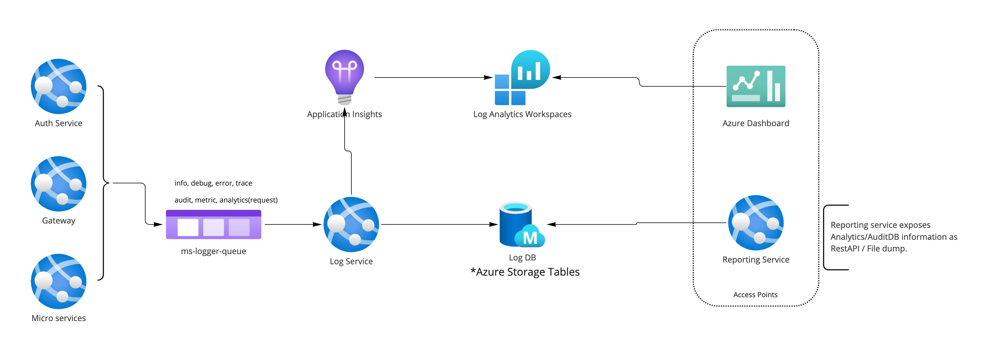

# Monitoring and auditing strategy
This document references the proposed strategy to accomodate the performance, audit and monitoring requirements of the system. The base requirements for this are captured under 
#50 
All the monitoring and auditing needs are handled by composing them into logs and storing/retreiving them appropriately. Once the logs are persisted, another micro-service exposes the information 
required as APIs.

The overall architecture for capturing the logs is as follows:

NOTE: Diagram to change the queue
## Architecture
- All the microservices send the audit/log/monitoring information as messages to `ms-logger-queue` via the methods exposed in `Core` library.
- The `Log service` is a microservice that listens to events/messages on `ms-logger-queue` and logs into appropriate location.
- The records are either stored in AppInsights or into Log DB based on their differentiation. 
- Log DB is hosted as Azure Storage tables with different tables handling different types of logs. However, it is under a single Storage account. Thus, its considered single entity on cloud.
- App Insights is configured within Log service
- All the API requirements for monitoring or notifications are exposed via `Reporting service`
- The differentiation of logs along with their details is explained in the next section.

## Logs differentiation
Based on the kind of information logged and their relevance, the logs are divided as follows:

### Diagnostic logs 
These are logs used by the developers of the micro-services to figure out any issues related to the development and also any additional information that needs to be logged 
for development and debugging usage.

There are two ways in which the logs can be captured.
1. Using the Core() methods . (eg. `Core.getLogger().info("xxxx")`)
2. Using the regular `console.x` methods. (eg. `console.log("xxx")`)

- The logs captured with `Core` methods are available under a centralized AppInsights which is common for all micro-services.
- The logs captured with regular `console.x` may not be available in the centralized AppInsights. However, if the azure resource is configured in cloud with AppInsights, the logs
 may be available in that particular AppInsights.
 - The diagnostic logs captured either way in AppInsights are **retained for 90 days**.

 ### Audit Logs
 These are the logs used for tracing the system. Typical usage includes the number of API keys generated for an agency, users created, files ingested and the amount of time it took.
 These are exposed to the developer via `Core.getLogger().getAuditor()` object. 
 - For any audit that requires a trail of events, an audit request is created and is updated appropriately.
 - An audit request may have different stages based on the work flow. (eg. gtfs-flex ingestion or user api key generation)
 - An audit request gets updated in different stages and the log of each stage is captured as an audit event (linked to audit request)
 - An audit request may or may not have events associated with it based on the stage and the work flow.

 Typical use cases of audit logs
 - API Key request 
 - Data ingestion 
 - API authorization
 - API access to the gateway requests

 As part of `Core` it exposes three methods for creating and updating the audit requests and events.
 - `Core.getLogger().getAuditor().addRequest`
 - `Core.getLogger().getAuditor().updateRequest`
 - `Core.getLogger().getAuditor().addEvent`

 