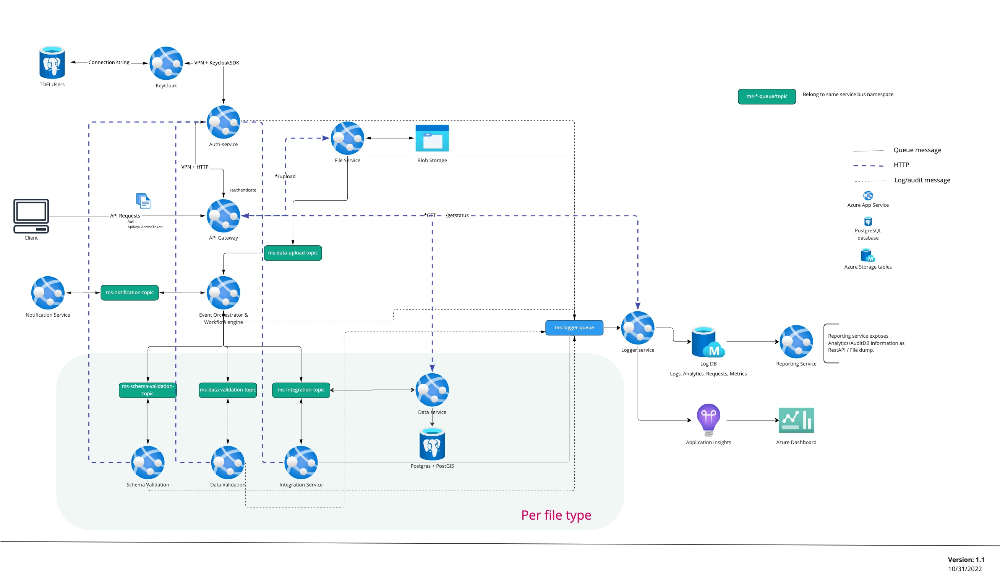

# System architecture
This document explains the current architectue of the TDEI system and the components along with their interactions.

## Architecture 

## Connectivity
Throughout the system there are three ways of communicating between the components
1. Through HTTP interface : This is done for the systems where the requestor waits for the response. Eg. Auth-service. Any service communicating to this may need a response. All the internal HTTP interfaces are secured through internal VPN specific to the Resource Group.
2. Topics: These are for further processing of information. Any service that needs to communicate asynchronously adapts to this strategy. 
3. Database/ Cloud interface : Any database connection or Cloud system connection is done through this.

## Components 

### Client system 
- The client system is reference to all the downstream applications and web-apps that make use of the TDEI system. These are connected to TDEI system via REST APIs exposed.
- The REST APIs are documented via Swagger for publicly available APIs and also internal Swaggers for any internal APIs
- The REST APIs are access-controlled based on the PATH and the METHOD.
- There are two ways of access control : API Key based and Access Token based.

### Gateway
- Gateway acts as the primary interface for all the REST APIs
- Gateway connects to Auth-service via VPN + HTTP connection.
- Gateway performs a minimal check of valid AccessToken or API Key via Auth-service for the API calls.
- Gateway processes all the Authentication requests + User Generation (token generation, role change, adding new user) via Auth-service.
- Gateway code  is currently hosted as Azure DevOps repository with a pipeline to generate container and deploy as App Service.(refer to README.md of gateway repo for this)
- All the upload requests are pre-validated and sent to `File-Service` for processing and response is relayed back to the client.
- All the GET requests are sent to `Data service` for processing and response is relayed back to the client.
- All the requests for getting the status of a request/upload or a job are sent to `Logger service`
- The gateway also hosts the Swagger documentation that is exposed to the public.

### Auth service 
- Responsible for authentication of users, user management
- Exposes internal HTTP APIs for authenticating a user and also validating a particular user against a permission. (eg. whether a specific userId is permitted to upload gtfs-flex)
- For all the internal purposes, it connects to Keycloak server via Keycloak SDK + VPN.
- Though there is swagger documentation of the APIs for this, these are not exposed to the public and are for internal use only
- The micro service code is currently hosted in Azure DevOps repository with a pipeline to generate container and deploy as App Service. Refer to README.md of auth-n-z repo 
- The internal HTTP APIs are accessible for all the micro-services within the system but not publicly available.

### Keycloak
- Responsible for user management of the system
- An Opensource implementation of Keycloak along with certain customization is hosted as App Service in Azure cloud. 
- Keycloak version picked is 19.0.2
- It does not expose API to any other system other than Auth-service 
- It connects to TDEI Users Database for all the persistence.
- Currently the code for this is hosted offline and is deployed manually.

### TDEI Users
- Responsible for hosting the user information
- Hosted as Postgresql instance in Azure cloud
- Data encryption for password is done at column level
- Data encryption at rest is done volume level by Azure 
- Has open connection only with the Keycloak hosted in the system.

### File Service
- Responsible for handling the file upload loads for the system.
- Has methodology to verify and upload the files per role.
- Verifies the permission of the user and then uploads the files appropriately to blob storage.
- Once the upload is done, creates a unique jobId and sends the following information to `ms-data-upload-topic`
    - jobId
    - file path for the files uploaded
    - user-access-token/credentials
    - type of file
    - any additional information based on the file type and request type.
- Also writes to `ms-logger-topic` on the actions performed. (audit logs.)
- This is not yet built but is planned to be hosted as a container with Azure App service.

### Blob Storage 
- Contains all the files uploaded to the system.
- Read/write permissions to this are to be configured as per the need for the micro-service.
- Currently hosted with ZRS (Zone redundant storage). Refer to [Azure Redundancy](../general/azure-redundancy.md)

### Event Orchestrator
- This component is responsible for ensuring the step by step processing of the files uploaded.
- Communicates with multiple queues as defined by the process. (Eg. GTFS-FLEX upload -> schema-validation -> data validation -> Conflation)
- Also responsible for notifying user personas as per configuration. Eg. Any conflicts with validation should send email.
- Also writes to `ms-logger-topic` on the actions performed over a specific upload or a request.
- Event Orchestrator is mainly considered for ensuring the processing sequence for the files.
- All other requests regarding the system (eg. list all agencies) are handled by other micro-services.
- Event Orchestrator is yet to be built but is planned to be hosted as a container with Azure App service.
- Does not do any processing of the files on its own. Is only responsible for initiating sub-process and listening to its completion.

### Schema microservices
- All the micro services that are responsible for sub-processing of the files comprise of schema microservices
- Based on the filetype, there may be 3 or 4 microservices. (Eg. Data validation, schema validation, Integration)
- Each schema microservice is written with either NodeJS or Python along with the Core package provided by GS.
- Processing is done by listening to the topic for certain messageType.
- Once the message is received with the file and other information, the files are processed and a response message is sent against the same (asynchronously).
- Naming convention is followed for the topic listened and the micro service.
    - Eg. GTFS-Flex data validation: Micro service will be named `ms-gtfs-flex-data-validation` and topic will be `ms-gtfs-flex-data-validation-topic`
- Each of the schema service may interact with blob storage via Core package.
- All the schema services are bound to be hosted as Azure App services either directly or through containerization.
NOTE:
- Any data persistence by the schema microservices is assumed to be handled by UW and hence not represented.
- Current assumption is that data persistence is done per file type and all the schema micro-services for that file type share a common database.

### Data service
- Responsible for handling the GET calls of the API.
- This will be a mixed responsibility of UW and GS 
- For all the GET calls related to non-schema based APIs (eg. agency list, version list, file location), GS is responsible.
- For all the GET calls related to schema(eg. stations), UW will be responsible.
- Collaboration on this service will be determined at a later stage.

### Logger service
- Responsible for handling all the logging information
- Based on the message type received from `ms-logger-queue`, bifurcates and stores appropriately
- The detailed description of Logger service and its functions is described in [Monitoring Audit strategy](./monitoring-audit-strategy.md)
- Also responsible for responding to getStatus call of the API for any job request.
- This is not yet built but is planned to be hosted as a container with Azure App service.
- Writes to Log DB via Azure configuration.
- Writes all the diagnostic logs to AppInsights as configured.

### Log DB
- Hosted as Azure Storage Tables.
- Responsible for all the audit, analytical and metric logs.
- Separate tables are defined for each functionality.
- Data ingress is via Logger service only.
- Data egress is via Reporting service and azure storage browser online(only for internal use).

### AppInsights
- Configured to read the diagnostic logs of the system.
- Anything that is logged via Core package will be available in the common AppInsights.
- All the console.* methods within the typescript or system logs will be available with the specific Azure resource if AppInsights is configured on the cloud.

## Component ownership + Azure resource 

| Component name | Ownership | Azure Resource Used |
|-|-|-|
| API Gateway | GS | App Service |
| Auth-service | GS | App Service |
| Keycloak | GS | App Service |
| File servie | GS | App Service |
| Blob Storage | GS + UW | Azure Blob Storage |
| Event Orchestrator | GS | App Service |
| Notification service | GS + UW | App Service |
| Schema microservices | UW | App Service |
| Logger service | GS | App Service |
| Reporting Service | GS | App Service | 
| Data service | GS + UW | App Service |
| App Insights + Workspace | GS + UW | App Insights + Analytics workspace |
| TDEI Users | GS | Postgresql on azure |
| PostGIS | UW | Postgresql on Azure* |

## Message queues/Topics
Some of the inter micro-service communication if presumed asynchronous is done via message topics. As of now, all the message topics are named based on the micro-service that ingests 
the messages.
Azure provides messaging topics as part of an Azure service bus namespace. As of now, there is only one Azure service bus per environment. This can be changed based on further requirement.