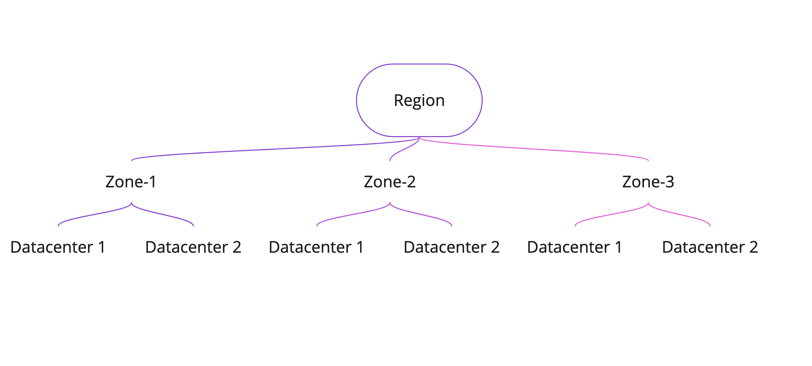

#  Types of redundancy supported in Azure
- Naresh Kumar

Many of the Azure offerings by default give out a redundancy or duplication option which will enable us to do a recovery of data or the service when there is an outtage or failure of the system. 
There are about 4 options to choose from and these depend directly on the requirement.

To understand the terminology, we have to understand the topography of how these server farms (cloud) is distributed across the globe. The heirarchy goes like Region, Zone and Datacenter. 

This is depicted by the diagram below

Each resource is set to have a primary region and an optional secondary region for storage and redundancy

# LRS
Locally redundant option (LRS) replicates your resource three times within a single data center in the primary region.

# ZRS
Zone redundant option (ZRS) replicates your resource three times within different zones of the same primary region 

# GRS
Geo redundant option replicates under different conditions within different regions. For this, the resource has to be alloted a secondary region.
There are two options for this

- Make an LRS in the primary region and another LRS in the secondary region 
- Make a ZRS in primary region and another LRS in the secondary region 

(Making ZRS in both regions is not yet supported)

A hybrid option with GRS is to keep the primary region copy available but the secondary region copy as a failover only. Thus, though the duplicate is available, it is kept only for failover cases. 

Reference : 
[Storage Redundancy](https://learn.microsoft.com/en-us/azure/storage/common/storage-redundancy)