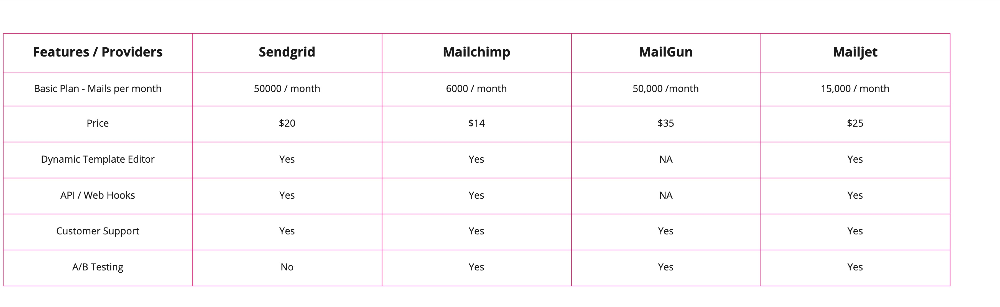

# Email providers with Azure integration

## Problem statement
For various functionalities within the system, there is a need to configure the emails and templates that will be sending out the information to respective users. 
Compare the various mail service providers that can be integrated with the Azure cloud.

## Research findings
There are 4 solutions looked into.

- [Sendgrid](https://sendgrid.com/)
- [Mailchimp](https://mailchimp.com/en-gb/)
- [MailGun](https://www.mailgun.com/)
- [Mailjet](https://www.mailjet.com/)

Here are the options and their pricings for the same.

## Other alternatives 
- [Sendinblue](https://www.sendinblue.com/)

## Further queries
- How are the templates handled?
- Who will edit the templates and keep the versions?

## Conclusion
Out of the available options SendGrid offers quite a bit of integration options with Azure. Will have to look at the rest as well.